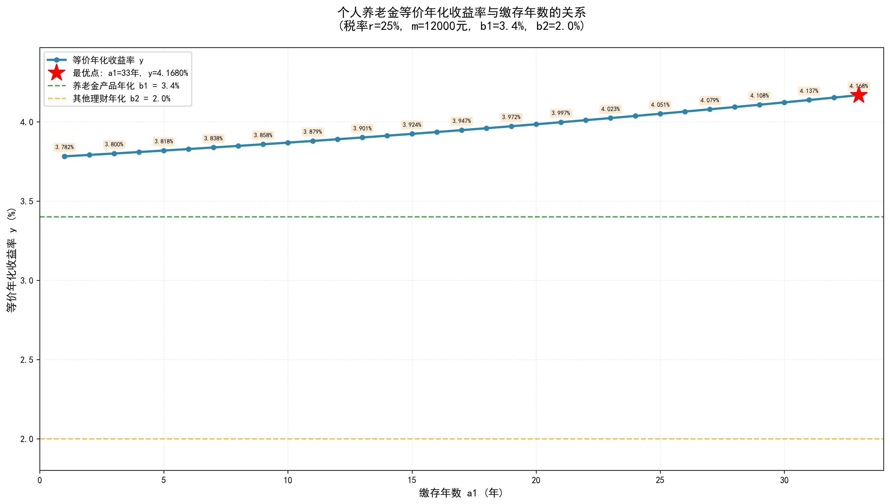
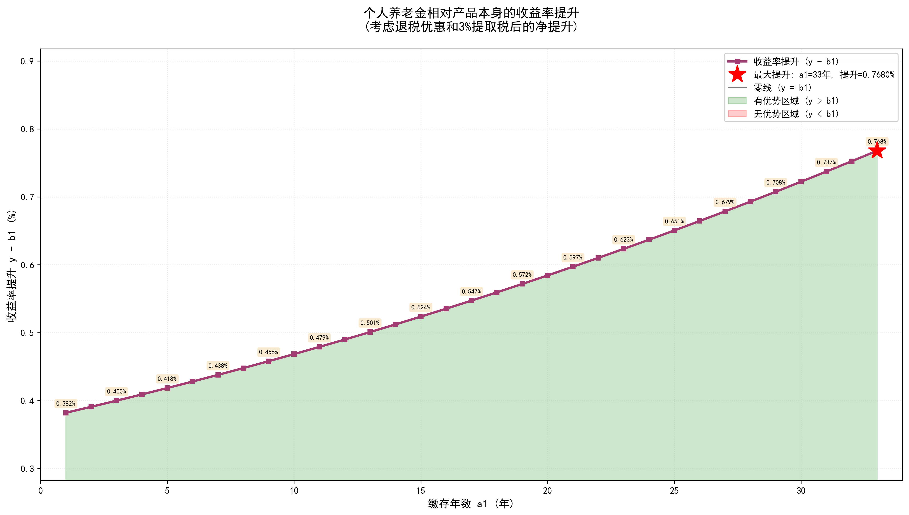
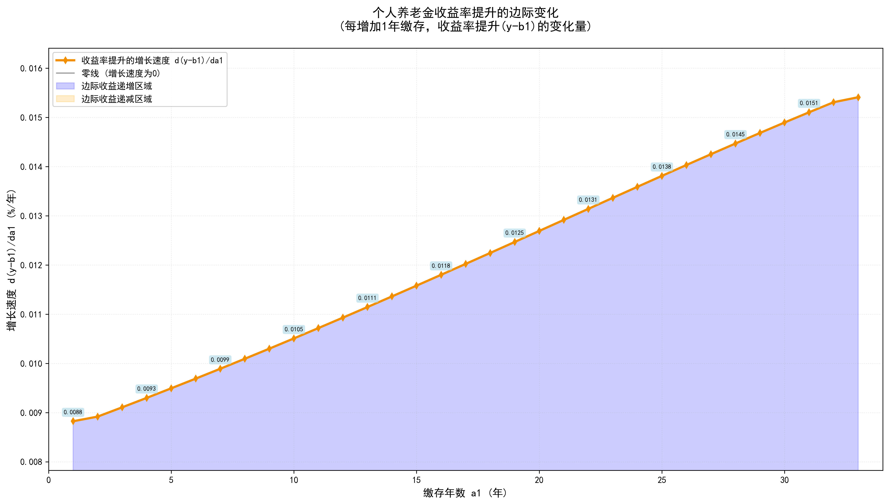
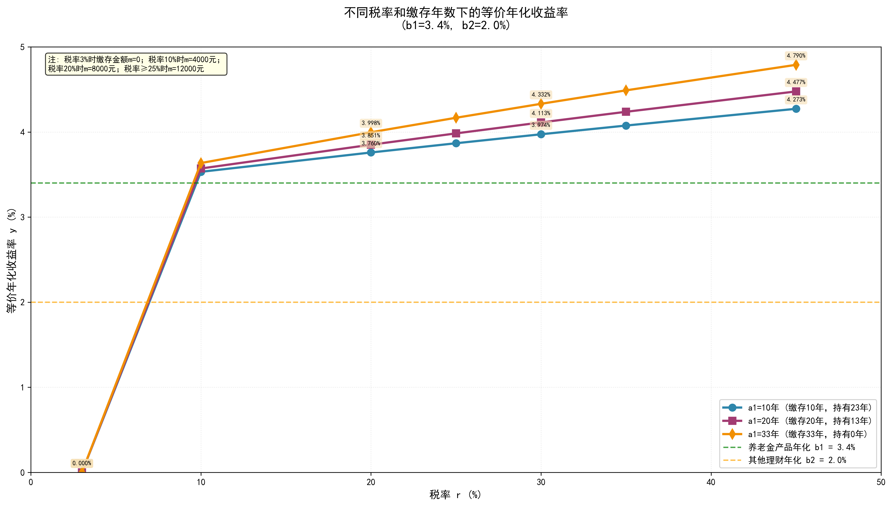
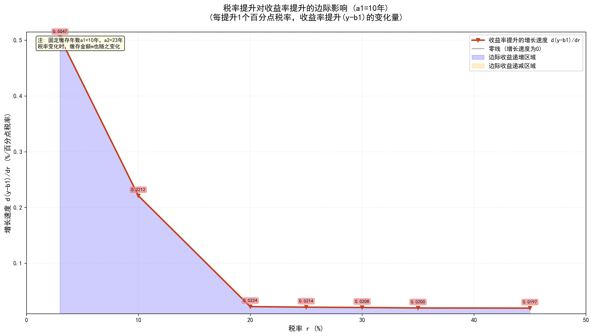
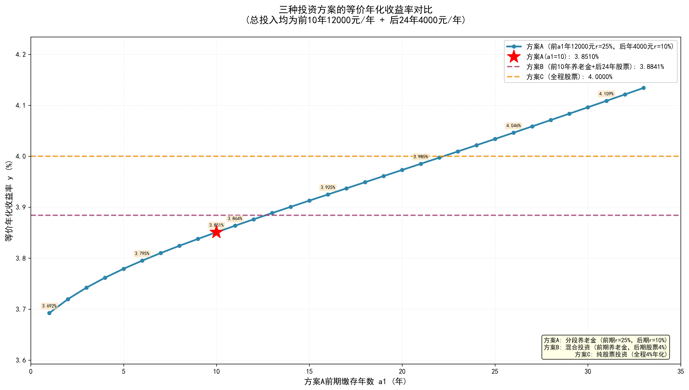
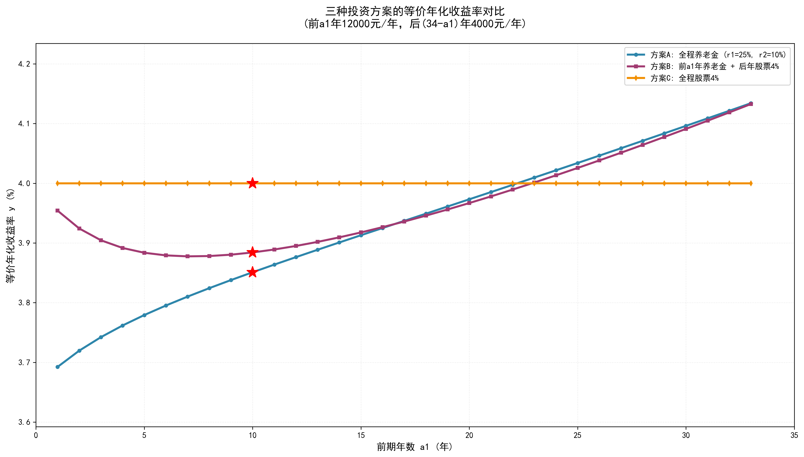
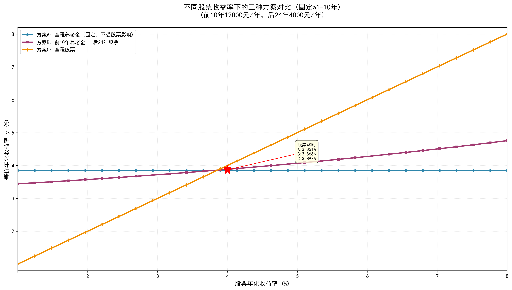

# 个人养老金投资收益分析

## 概述

### 变量定义

本文分析涉及以下变量：

1. **r** - 当前税率
2. **m** - 每年缴存金额（元）
3. **a1** - 缴存年数（年）
4. **a2** - 缴存结束后距离退休的年数（年）
5. **b1** - 个人养老金理财产品年化收益率
6. **b2** - 其他理财产品年化收益率
7. **y** - 个人养老金综合年化收益率（含退税优惠）

### 基本假设

为简化计算，本文不考虑通胀因素。按照当前经济状况，到退休时能走出通缩已属不易。

---

## 一、理论推导

### 1.1 方案A：投资个人养老金（含退税优惠）

#### 收益来源

个人养老金投资的收益由两部分组成：

**（1）养老金账户本金和收益**

- 第1年缴存m元，到退休时（第a1+a2年末）经历a1+a2年复利：`m·(1+b1)^(a1+a2)`
- 第2年缴存m元，到退休时经历a1+a2-1年复利：`m·(1+b1)^(a1+a2-1)`
- ……
- 第a1年缴存m元，到退休时经历a2+1年复利：`m·(1+b1)^(a2+1)`

采用等比数列求和公式，总计为：

```
S1 = m·[(1+b1)^(a1+a2) + (1+b1)^(a1+a2-1) + ... + (1+b1)^(a2+1)]
   = m·(1+b1)^(a2+1) · [(1+b1)^a1 - 1] / b1
```

扣除提取时3%的税后：

```
S1_净 = m·(1+b1)^(a2+1) · [(1+b1)^a1 - 1] / b1 · 0.97
```

**（2）退税部分再投资收益**

每年缴存m元，按税率r获得退税m·r，退税立即投资到其他理财产品（年化收益率b2）：

- 第1年退税m·r，到退休时经历a1+a2年复利：`m·r·(1+b2)^(a1+a2)`
- 第2年退税m·r，到退休时经历a1+a2-1年复利：`m·r·(1+b2)^(a1+a2-1)`
- ……
- 第a1年退税m·r，到退休时经历a2+1年复利：`m·r·(1+b2)^(a2+1)`

总计为：

```
S2 = m·r·[(1+b2)^(a1+a2) + (1+b2)^(a1+a2-1) + ... + (1+b2)^(a2+1)]
   = m·r·(1+b2)^(a2+1) · [(1+b2)^a1 - 1] / b2
```

**方案A总收益：**

```
V_A = S1_净 + S2
    = m·(1+b1)^(a2+1) · [(1+b1)^a1 - 1] / b1 · 0.97
      + m·r·(1+b2)^(a2+1) · [(1+b2)^a1 - 1] / b2
```

#### 等价年化收益率y

假设以年化收益率y投资m元，缴存a1年后到退休（共a1+a2年），应得到相同的收益V_A。则有：

```
m·(1+y)^(a2+1) · [(1+y)^a1 - 1] / y = V_A
```

即：

```
(1+y)^(a2+1) · [(1+y)^a1 - 1] / y =
    0.97 · (1+b1)^(a2+1) · [(1+b1)^a1 - 1] / b1
    + r · (1+b2)^(a2+1) · [(1+b2)^a1 - 1] / b2
```

这是关于y的超越方程，无法求出解析解。但我们可以固定部分变量，通过数值方法分析其他变量之间的关系。

由于理财产品的年化收益率无法保持稳定且难以预测，为简化分析，假定理财产品在未来保持当前收益率不变。

---

### 1.2 缴存年数a1与收益率y的关系

#### 场景设定

假设某位30岁的体制内工作人员，当前税率r和每年缴存额度m固定，仅需考虑缴存多少年能达到最优收益。参数设定如下：

- r = 25%
- m = 12,000元
- a2 = 33 - a1（63岁退休，总计33年）
- b1 = 3.4%
- b2 = 2%

#### 推导过程

将上述参数代入超越方程：

```
(1+y)^(34-a1) · [(1+y)^a1 - 1] / y =
    0.97 · (1.034)^(34-a1) · [(1.034)^a1 - 1] / 0.034
    + 0.25 · (1.02)^(34-a1) · [(1.02)^a1 - 1] / 0.02
```

简化右侧：

```
右侧 = 0.97 · (1.034)^(34-a1) · [(1.034)^a1 - 1] / 0.034
       + 12.5 · (1.02)^(34-a1) · [(1.02)^a1 - 1]
```

虽然仍无解析解，但对于不同的a1值（从1到33年），可以通过数值方法求解对应的y值。由于a1取值范围有限，可以轻松绘制关系曲线。

#### 可视化分析

**图1：缴存年数a1与等价年化收益率y的关系**

下图展示了在给定参数下，缴存年数a1与等价年化收益率y的关系：



**图2：缴存年数a1与收益率提升(y-b1)的关系**

下图展示了相对于养老金产品本身年化收益率(b1=3.4%)，考虑退税优惠和3%提取税后的净收益率提升：



**图2解读：**

- 图中每个点代表在该缴存年数下，整体年化收益率y相比产品本身年化b1的提升幅度
- 正值区域（绿色）表示投资个人养老金有优势
- 提升幅度 = 退税带来的收益 - 3%提取税的损失
- 可以直观看出：缴存年数越多，净收益提升越高

**图3：缴存年数a1与收益率提升增长速度的关系**

下图展示了收益率提升(y-b1)的边际变化，即d(y-b1)/da1：



**图3解读：**

- 图中展示的是边际收益，即每多缴存1年，收益率提升(y-b1)会增加多少个百分点
- 正值区域（蓝色）表示边际收益递增：缴存时间越长，优势提升越快
- 实际意义：帮助判断在什么缴存年数下，多缴存一年的额外收益最大
- 从图中可以看出，边际效益是不断提高的。初期阶段，退税收益会被时间价值抵消；越接近退休，退税带来的收益优势越明显

---

### 1.3 税率r、缴存金额m与收益率y的关系

#### 场景设定

假设某位30岁的私企员工，可能在35岁左右面临失业风险。为了解不同税率和缴存金额对收益率的影响，设定以下参数：

- m = f(r)（缴存金额随税率变化）
- a2 = 33 - a1（63岁退休，总计33年）
- b1 = 3.4%
- b2 = 2%

缴存金额函数f(r)定义如下：

```
f(r) = {
    12,000元  当 r ∈ [25%, 30%, 35%, 45%]
     8,000元  当 r = 20%
     4,000元  当 r = 10%
         0元  当 r = 3%
}
```

#### 可视化分析

**图4：不同税率和缴存年数下的等价年化收益率**

下图展示了三种不同缴存年数(a1=10年、20年、33年)下，税率r与等价年化收益率y的关系：



**图4解读：**

- 图中三条折线分别代表缴存10年、20年、33年的情况
- 横轴为税率r，纵轴为等价年化收益率y
- 税率越高，退税金额越大，等价年化收益率y越高
- 缴存年数越长(a1越大)，整体年化收益率y越高
- 税率3%时不缴存(m=0)，所有曲线的y值都为0
- 实际意义：帮助不同税率档位的人判断是否值得投资个人养老金，以及投资多久最合适

**图5：税率提升对收益率提升的边际影响（a1=10年）**

下图展示了固定缴存年数a1=10年时，税率r与收益率提升(y-b1)增长速度的关系，即d(y-b1)/dr：



**图5解读：**

- 图中展示了在a1=10年的情况下，每提升1个百分点税率，收益率提升(y-b1)会增加多少
- 横轴为税率r，纵轴为边际收益 d(y-b1)/dr
- 正值区域表示税率提升带来正向边际收益
- 数值越大，说明该税率区间对收益提升的边际贡献越大
- **由于不同税率对应不同的缴存金额m，增长速度会出现跳跃**。从图表看，税率达到20%以后，节税带来的边际效益开始下降。因此在10%-20%税率区间，个人养老金的节税效率最高
- 实际意义：帮助判断税率变化对养老金投资收益的影响程度，以及在哪个税率档位边际收益最高

---

## 二、实际案例分析

### 2.1 三种投资方案设定

考虑以下实际场景，设定三种投资方案进行对比：

**方案A：全程个人养老金（稳健型）**

分两个阶段缴存个人养老金：
- **前10年**（高收入期）：
  - 税率 r1 = 25%
  - 缴存金额 m1 = 12,000元/年
- **后24年**（低收入期）：
  - 税率 r2 = 10%
  - 缴存金额 m2 = 4,000元/年
- **理财参数**：
  - 养老金产品年化 b1 = 3.45%
  - 退税再投资年化 b2 = 1.8%（债券、货币基金为主的低风险组合）

**方案B：前期养老金 + 后期股票（平衡型）**

- **前10年**：与方案A相同，缴存个人养老金
  - 税率 r = 25%
  - 缴存金额 m = 12,000元/年
  - 养老金产品年化 b1 = 3.45%
  - 退税再投资年化 b2 = 1.8%
- **后24年**：投资股票
  - 投资金额 = 4,000元/年
  - 预期年化收益率 = 4%

**方案C：全程股票投资（激进型）**

- **前10年**：
  - 投资金额 = 12,000元/年
  - 股票年化收益率 = 4%
- **后24年**：
  - 投资金额 = 4,000元/年
  - 股票年化收益率 = 4%

**总投入对比**：三种方案总投入均为 12,000×10 + 4,000×24 = 216,000元

---

### 2.2 收益计算推导

#### 方案A：分段缴存个人养老金

**到退休时总收益计算：**

1. **前10年养老金本息（到退休时）：**
   ```
   V1 = 12,000 × (1.0345)^34 + 12,000 × (1.0345)^33 + ... + 12,000 × (1.0345)^25
      = 12,000 × (1.0345)^25 × [(1.0345)^10 - 1] / 0.0345
   ```

2. **后24年养老金本息（到退休时）：**
   ```
   V2 = 4,000 × (1.0345)^24 + 4,000 × (1.0345)^23 + ... + 4,000 × (1.0345)^1
      = 4,000 × (1.0345)^1 × [(1.0345)^24 - 1] / 0.0345
   ```

3. **养老金总额扣除3%税：**
   ```
   V_pension = (V1 + V2) × 0.97
   ```

4. **前10年退税投资收益（到退休时）：**
   ```
   V3 = 3,000 × (1.018)^34 + 3,000 × (1.018)^33 + ... + 3,000 × (1.018)^25
      = 3,000 × (1.018)^25 × [(1.018)^10 - 1] / 0.018
   ```

5. **后24年退税投资收益（到退休时）：**
   ```
   V4 = 400 × (1.018)^24 + 400 × (1.018)^23 + ... + 400 × (1.018)^1
      = 400 × (1.018)^1 × [(1.018)^24 - 1] / 0.018
   ```

6. **方案A总收益：**
   ```
   V_A = V_pension + V3 + V4
   ```

#### 方案B：前期养老金 + 后期股票

**前10年养老金部分：**
- 养老金本息（到退休时）：V1（扣除3%税后）
- 退税收益（到退休时）：V3

**后24年股票投资：**
```
V5 = 4,000 × (1.04)^24 + 4,000 × (1.04)^23 + ... + 4,000 × (1.04)^1
   = 4,000 × 1.04 × [(1.04)^24 - 1] / 0.04
```

**方案B总收益：**
```
V_B = V1×0.97 + V3 + V5
```

#### 方案C：全程股票投资

**前10年：**
```
V6 = 12,000 × (1.04)^34 + 12,000 × (1.04)^33 + ... + 12,000 × (1.04)^25
   = 12,000 × (1.04)^25 × [(1.04)^10 - 1] / 0.04
```

**后24年：**
```
V7 = 4,000 × (1.04)^24 + 4,000 × (1.04)^23 + ... + 4,000 × (1.04)^1
   = 4,000 × 1.04 × [(1.04)^24 - 1] / 0.04
```

**方案C总收益：**
```
V_C = V6 + V7
```

#### 等价年化收益率计算

对于每个方案，等价年化收益率y满足：

```
总投入按年金方式计算的终值 = 实际总收益

前10年按12,000元/年，后24年按4,000元/年的年金终值：
FV = 12,000 × (1+y)^25 × [(1+y)^10 - 1] / y
     + 4,000 × (1+y)^1 × [(1+y)^24 - 1] / y

求解 FV = V_A（或 V_B, V_C）得到各方案的y
```

---

### 2.3 可视化对比分析

#### 图6：三种投资方案的等价年化收益率对比

下图展示了三种方案的对比：
- 方案A的曲线：以前期缴存年数a1为横轴，展示不同a1下的等价年化收益率
- 方案B的水平线：前10年养老金 + 后24年股票的固定收益率
- 方案C的水平线：全程股票投资的固定收益率



**图6解读：**

- 方案A曲线展示了调整前期养老金缴存年数对整体收益的影响
- 红色星标标记了方案A在a1=10时的收益率，便于与方案B、C对比
- 方案B和C为固定策略，收益率恒定

#### 图7：三种方案随前期年数a1变化的对比

为了更全面地比较三种方案，将所有方案都以a1为横轴进行分析：
- 方案A：全程养老金，前a1年高税率(25%)，后(34-a1)年低税率(10%)
- 方案B：前a1年养老金(25%税率)，后(34-a1)年股票投资(4%年化)
- 方案C：全程股票投资(4%年化)



**图7解读：**

- **方案A（蓝色曲线）**：随着a1增加，等价年化收益率呈现逐步上升的趋势
  - 只有在a1足够大，也就是前期高投入时间足够长时，才能追平方案B和方案C的收益率
  - 需要持续高薪15年，投入个人养老金才能赶上方案B；持续高薪23年，才能赶上方案C
  - 不过方案B和方案C能在股市保持4%的年化，也需要足够的耐心和理性

- **方案B（紫色曲线）**：随a1增加先下降，后上升
  - 在a1较小时下降，主要是因为退税的复利效应因本金过少而跑不过股票投资的效益
  - 随着对个人养老金的高额投入+高额退税（8年以上），退税效应才能追平或超过持续少量投资股票的收益
  - 在高额投资个人养老金+高额退税15年以上时，收益率基本和方案A重合

- **方案C（橙色水平线）**：保持恒定
  - 全程股票投资，不受a1影响
  - 基准收益率为4%（股票年化）

- **红色星标**：标注a1=10的位置，便于对比三种方案在该点的收益率

#### 图8：固定a1=10，不同股票收益率下的方案对比

股票市场收益率具有不确定性。为了评估不同股票年化收益率对各方案的影响，固定a1=10，将股票年化收益率作为变量：



**图8解读：**

- **方案A（蓝色水平线）**：完全不受股票收益率影响
  - 全程养老金投资，收益率恒定
  - 仅受养老金产品收益率(3.45%)、税率(25%/10%)和退税再投资(1.8%)影响

- **方案B（紫色上升曲线）**：部分受股票收益率影响
  - 前10年养老金部分不变
  - 后24年股票投资收益随股票年化线性增长
  - 斜率小于方案C（因为只有部分资金投资股票）

- **方案C（橙色上升曲线）**：完全受股票收益率影响
  - 全程股票投资，等价年化收益率与股票年化近似线性关系
  - 斜率最大，对股票市场最敏感

- **临界点分析**：
  - 当股票年化 < 约3.2%时，方案A优于方案B和C
  - 当股票年化在3.2%-4.5%之间时，方案B最优（兼顾收益与风险）
  - 当股票年化 > 约4.5%时，方案C最优

- **红色星标**：标注股票年化=4%的位置，对应基准假设

---

## 三、综合结论与建议

### 3.1 主要发现

通过以上理论推导和实际案例分析，可以得出以下结论：

**1. 方案选择取决于多个因素：**
- 个人收入变化趋势（决定最优a1）
- 股票市场预期收益率
- 风险承受能力

**2. 风险-收益权衡：**
- **方案A**：最稳健，收益确定性高，适合风险厌恶者
- **方案B**：平衡方案，部分享受退税优惠，部分参与市场增长
- **方案C**：高风险高收益，完全暴露于股票市场波动

**3. 最优策略建议：**
- 如果股票市场预期收益率 > 4.5%，选择**方案C**
- 如果股票市场预期收益率在3%-4.5%之间，选择**方案B**，a1选择10-15年
- 如果股票市场预期收益率 < 3%，选择**方案A**，a1选择10-15年

### 3.2 其他重要考虑因素

除收益率外，还需考虑以下风险因素：

**1. 政策稳定性风险**
- 如果30年后个人养老金政策发生重大变化，可能导致已缴存资金面临损失风险
- 建议关注政策动向，适时调整投资策略

**2. 流动性风险**
- 个人养老金流动性为零，退休前无法提取
- 如遇紧急事件（医疗、教育等），可能被迫变卖其他资产
- 建议保持足够的流动性储备

**3. 投资风险**
- 股票市场收益无法保证稳定，需要一定的投资技巧和运气
- 建议根据自身风险承受能力，合理配置资产比例

---

## 附录：数值计算结果

具体数值结果可通过运行以下Python脚本获得：
- `calculate_pension_yield.py` - 基础计算函数
- `plot_yield_vs_years.py` - 图1-5生成脚本
- `compare_three_scenarios.py` - 图6-8生成脚本

所有脚本均支持参数化输入，可根据实际情况调整参数进行分析。
